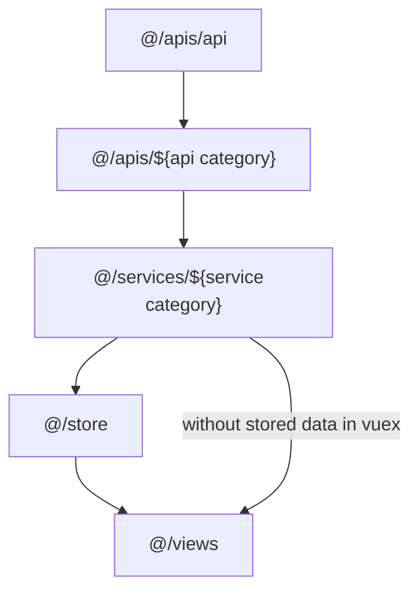

# Project

- [Demo Link](https://jerry-yeh.github.io/Travel-Guide/)
- [UI](https://www.figma.com/file/5HQAZ2bunGNKma2fwU0aNZ/The-F2E-3rd---Week1-%E5%8F%B0%E7%81%A3%E6%97%85%E9%81%8A%E6%99%AF%E9%BB%9E%E5%B0%8E%E8%A6%BD?node-id=0%3A1)
- [MOTC Transport API V2](https://ptx.transportdata.tw/MOTC/?urls.primaryName=%E8%A7%80%E5%85%89V2#/)
- [MOTC Transport API V3](https://gist.transportdata.tw/gist_api/swagger/ui/index#!/District/District_03001)

# Features

- RWD
- Keyword search
- Pagination

# Environment

- Vue3 Composition API
- Vite
- TypeScript
- ESLint
- Yarn
- SCSS
- Tailwind CSS
- Node.js v16

# VSCode Extensions

- [Volar](https://marketplace.visualstudio.com/items?itemName=johnsoncodehk.volar)
- [Vue 3 Snippets](https://marketplace.visualstudio.com/items?itemName=hollowtree.vue-snippets)
- [ESLint](https://marketplace.visualstudio.com/items?itemName=dbaeumer.vscode-eslint)
- [Markdown Preview Mermaid Support](https://marketplace.visualstudio.com/items?itemName=bierner.markdown-mermaid)

# Guideline

## Variable

- prop: name
- private: name\_
- vuex: \_name

## API Flow

